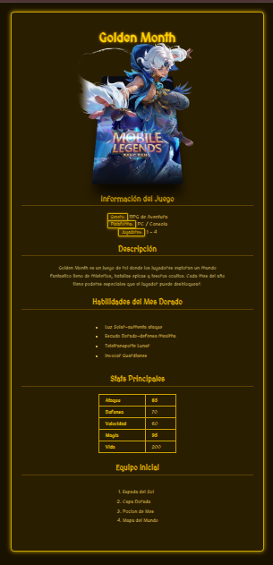

🌙 Golden Month - Página Web
Página web informativa sobre el juego Golden Month de Mobile Legends, con efecto de carta 3D al hacer hover.

## 📸 Vista Previa

Página con carta interactiva 3D, ficha de personaje, stats y equipo del juego.
🚀 Características

Efecto de carta 3D al pasar el mouse
Personaje que se levanta al hacer hover
Diseño dorado oscuro con fuente medieval
Tabla de stats y lista de habilidades
Totalmente en español

🧩 Estructura de Archivos
GOLDEN MONTH/
├── golden_month.html
├── golden_styles.css
└── imagenes/
    ├── PORTADA.jpg
    ├── ANIME.png
    └── titulo.png
🛠️ Cómo usar

Descarga todos los archivos
Asegúrate que la carpeta imagenes/ esté en el mismo directorio que el HTML
Abre golden_month.html en tu navegador
Pasa el mouse sobre la carta para ver el efecto 3D

🎨 Tecnologías usadas

HTML5
CSS3 (animaciones y transformaciones 3D)
Google Fonts (MedievalSharp)

📄 Autor
Proyecto realizado para la clase de Diseño Web.